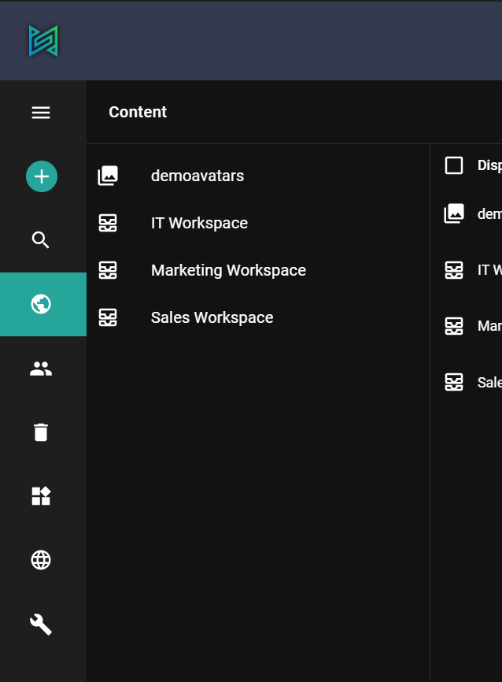
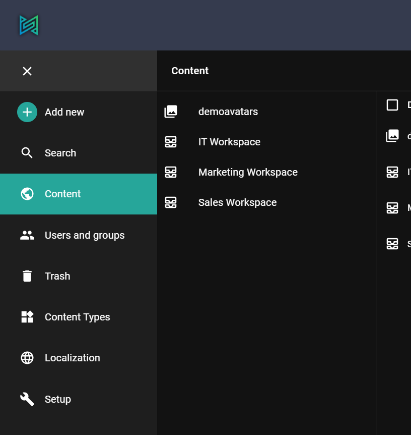
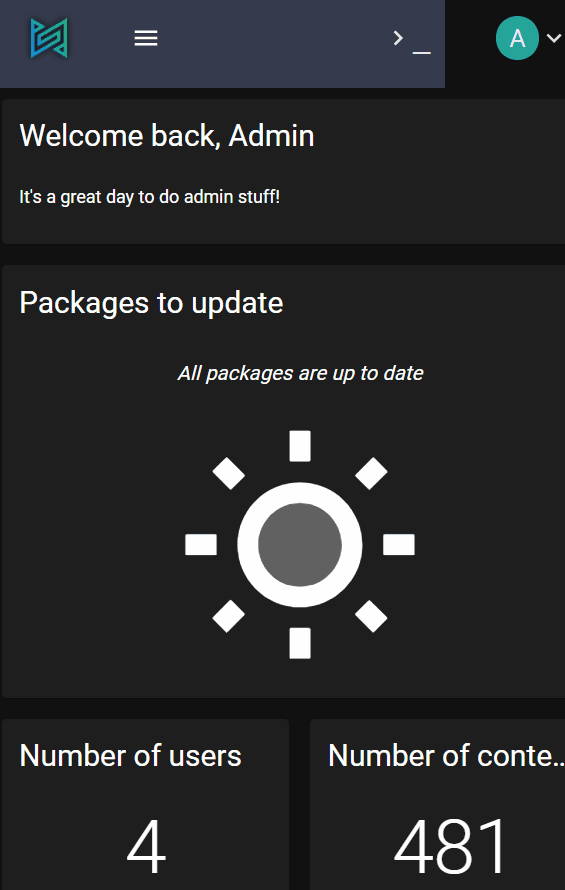

The Drawer component is the left side navigation menu. It lets you access the [personal settings](/guides/customization/00-personal-settings/), [setup](/guides/setup) and more other menupoints.

## Customization

You can customize the drawer within the [personal settings](/guides/customization/00-personal-settings/). You can set drawer options for multiple devices. For example mobile, tablet, desktop and in general for default. There are 3 main options:

1. [enabled](#enabled) - boolean value (it can be `true` or `false`)
2. [type](#type) - string value (`"mini-variant"`, `"permanent"`, `"temporary"`)
3. [items](#items) - array of DrawerItem (this is a complex type, look for examples below)

### Enabled

This it the simplest setting that can enable or disable the drawer itself.
> Don't worry if you disabled the drawer and can't find personal settings. You can access it from the [Command palette](/guides/search/03-command-palette) with typing in _personal settings_ and pressing enter.

Example setting:

```json
{
  "default": {
    "drawer": {
      "enabled": false
    }
  }
}
```

### Type

There are 3 possible values for choosing the type of the drawer:

**mini-variant** - This can be opened and closed as it is shown below. _This is currently the default setting for desktop mode_

{:height="600px"}

**permanent** - In this mode the drawer is always open.

{:height="600px"}

**temporary** - In this mode there is no sidebar only a hamburger menu in the top left corner. _This is currently the default setting for mobile mode_



### Items

Every drawer item has 3 properties, `settings`, `itemType`, `permissions`.

The `settings` property changes for item types, there are items that don't have settings at all.

The `itemType` is a predefined string you can see the possible values with pressing **CTRL+SPACE** in the editor.

The `permissions` property is an array of objects that has a path and action property. The name of the action that will be checked against the path.

```json
{
  "default": {
    "drawer": {
      "items": [
        {
          "itemType": "Localization",
          "permissions": [
            {
              "path": "/Root/Localization",
              "action": "Add"
            }
          ]
        }
      ]
    }
  }
}
```

Item types without settings:

- `Content Types` - shows list of [content type definitions](/concepts/content-management/03-content-types)
- `Localization` - shows list of localization resources
- `Search` - shows list of saved queries
- `Setup` - shows a sensenet related [settings](/guides/setup)
- `Trash` - shows list of items that are not deleted permanently
- `Version info` - shows information about admin-ui and sensenet versions
- `Users and groups` - shows list of users and groups

Item types with settings:

- [Dashboard](/guides/customization/05-dashboard-customization)

```json
{
  "itemType": "Dashboard",
  "settings": {
    "dashboardName": "main",
    "description": "This is the main dashboard",
    "icon": "SystemFolder",
    "title": "Dashboard"
  }
}
```

- Query - this works like a smart folder, shows a list of query result
  - term - is a [content query](/concepts/basics/041-content-query)
  - columns - array of columns to display. These are the name of the fields on the content

```json
{
  "itemType": "Query",
  "settings": {
    "description": "5 Files that modified recently",
    "icon": "LinkList",
    "title": "Recent files",
    "term": "+Type:File .REVERSESORT:ModificationDate .TOP:5",
    "columns": ["DisplayName", "ModifiedBy", "ModificationDate"]
  }
}
```

- Content - lets you explore and manage your content
  - browseType - can take 3 values
    - simple - shows the content in a simple list
    - explore - shows a tree on the left side and a simple list on the right
    - commander - two lists side by side
  - root - content will be displayed below this level

```json
{
  "itemType": "Content",
  "settings": {
    "description": "Explore your content",
    "icon": "Workspace",
    "title": "Content",
    "columns": ["DisplayName", "ModifiedBy", "ModificationDate"],
    "browseType": "explorer",
    "root": "/Root"
  }
}
```
