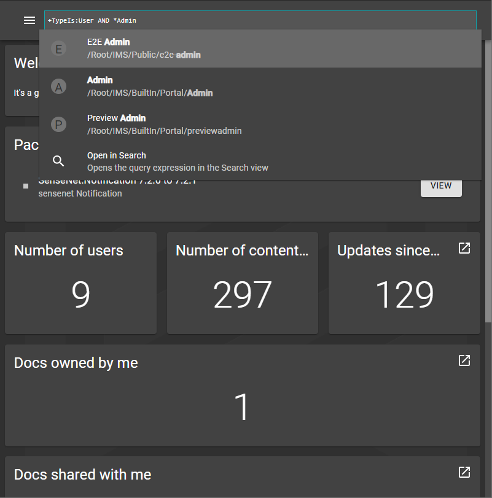

The Command Palette is a flexible tool that allows you to execute operations like navigation, searching or custom actions by simply searching and selecting them. You can activate it with the **>\_** icon, the **CTRL+P** or **CTRL+SHIT+P** (custom action mode).

## Navigation between pages

You can navigate between the pages by simply typing a name of a page or the page description. The available pages are:

- Personal Settings
- Content
- Search
- Event log
- Help

You can open a page by simply clicking on it.

## Search by path

You can search content in the current repository (or the last used one) by starting to type it's path (It should start with '/Root'). You will get a dropdown with the suggestions and open content items by simply clicking on them.

## Search with a content query

You can write [content queries](/concepts/basics/041-content-query/) to search content. The expression should start with a **+** sign. You will get a list of suggestions and an option to open the current expression in the _Search_ view.

## Custom actions

You can execute custom actions on the **active** (last clicked) content. You should open the command palette with the **CTRL+SHIFT+P** keyboard combo or start with a **>** character. The available suggestions will be based on the available content actions.

If the action accepts parameters, you can provide them in JSON format. You will also get some help with code completion by pressing **CTRL+SPACE**. If the action has a JSON response, you can also preview it.
