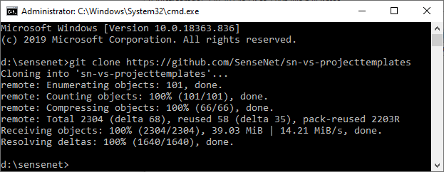
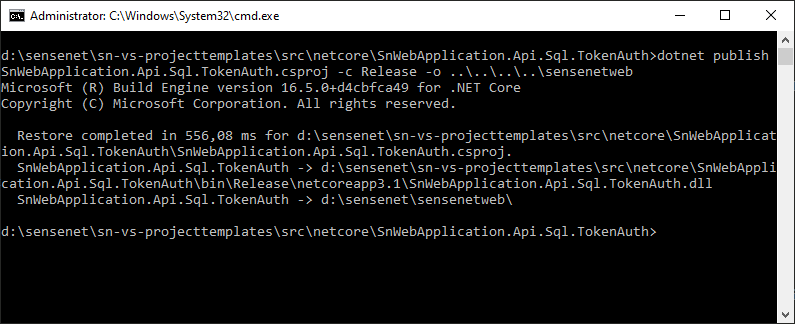
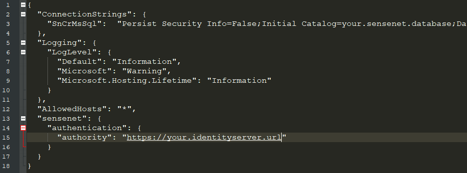
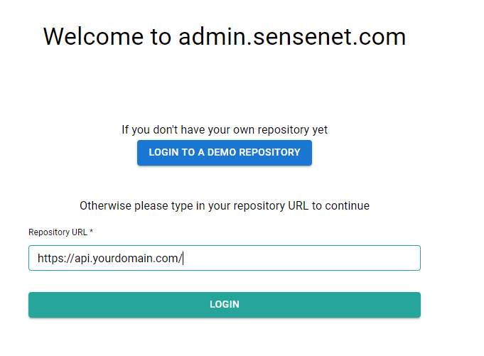

this tutorial use the following tools:

- git cli
- netcore cli
- iis

install by template

GitHub Source

We have a GitHub repository with a set of sample projects for various cases.
https://github.com/SenseNet/sn-vs-projecttemplates

1. So the first step to clone this repository:

	git clone https://github.com/SenseNet/sn-vs-projecttemplates

	

2. .NetCore project examples are in the "netcore" subfolder. Select the appropriate projects for your need.
To install sensenet two project will be needed. One is the netcore webapp as the sensenet api obviously, 
and an installer to create the database and the sensenet repository for this api.

The following example will use SnWebApplication.Api.Sql.TokenAuth project to demonstrate an install. 
This version of sensenet api use an mssql database and a local lucene folder. 
For authentication it connects to an external identity server.

	cd sn-vs-projecttemplates\src\netcore\SnWebApplication.Api.Sql.TokenAuth

3. publish the project to a webfolder, again this is one sample from many possible ways, I am using dotnet cli, this step 
automatically restores nuget packages too:

	dotnet publish SnWebApplication.Api.Sql.TokenAuth.csproj -c Release -o webFolderPath

	

Don't forget to set the connection string to your mssql database and identity server url in appsettings.json or with environment variables before start the application.

	ConnectionStrings.SnCrMsSql
	sensenet.authentication.authority

	

4. before start the service, we have to create the repository as mentioned eralier. For this we 
have a sample project in sn-vs-projecttemplates under "src\netcore\SnDemoConsoleInstaller" subfolder.
Set the same connection string as used with webapp in appsettings.json or environment variables:

	ConnectionStrings.SnCrMsSql
  
If you are familiar with sensenet import and/or snadmin packages you can set them with arrays of paths in the settings:

for content imports only:
	sensenet.install.import

for snadmin packages:
	sensenet.install.packages

	

	*before you run console installer you will have to create an empty database with the same name on your database server. If it is not
	available, the consoleinstaller will throw the following error:
		Unhandled exception. System.Data.SqlClient.SqlException (0x80131904): Cannot open database "YourDatabaseName" requested by the login. The login failed.
		
	?If database already exists the consoleinstaller will skip repository install and continues with import/packages section.?

You can either build, publish this project and run the executable or run directly* for example with dotnet cli:

	dotnet run SnConsoleInstaller.csproj -c Release

	

5. The consoleinstaller will create the lucene index in the file system along with the database. We have to copy this index under the webfolder before start the service.

	
	
6. now that our repository is prepared we have to create an IIS site, set path to the webfolder we had deployed the api and set application pool to no managed code.
(.Netcore has to be installed on the IIS server to be able to serve .netcore projects.)

	

	

7. if everything is set up properly now we can connect to this repo through admin ui.

	