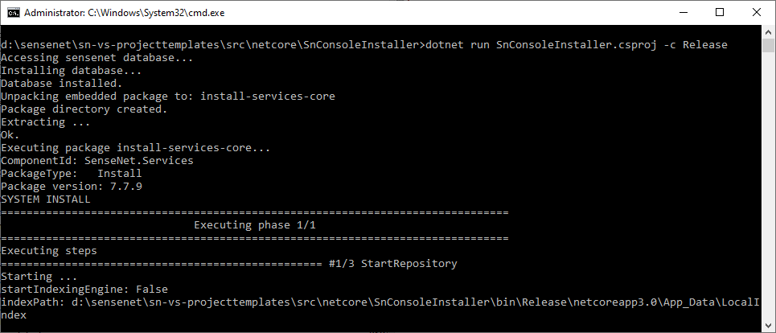
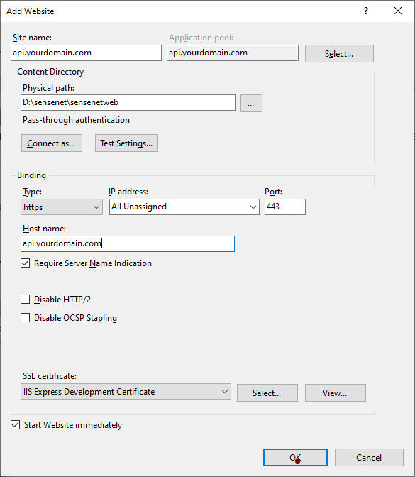

# Requirements

This tutorial use the following tools:

- [Git CLI](https://git-scm.com/book/en/v2/Getting-Started-The-Command-Line)
- [.Net core CLI](https://docs.microsoft.com/en-us/dotnet/core/tools/)
- [Microsoft IIS](https://www.iis.net/)

We have a [GitHub repository](https://github.com/SenseNet/sn-vs-projecttemplates) with a set of sample projects for various cases.

# Clone the repository

The first step is to clone the above mentioned repository:

```shell
git clone https://github.com/SenseNet/sn-vs-projecttemplates
```


# Install the project

The .Net Core project examples are in the *netcore* subfolder. Select the appropriate projects for your need. See the list of available templates and their content in the main [readme](https://github.com/SenseNet/sn-vs-projecttemplates).

To install sensenet two project will be needed. One is the netcore webapp for the sensenet service, and an installer to create the database and the sensenet repository for this API.

The following example will use `SnWebApplication.Api.Sql.TokenAuth` project to demonstrate the install process. This version of sensenet API use an MSSQL database and a local [Lucene](/tutorials/install/042-configuring-search-service) folder.

For authentication it connects to an external [Identity Server](/tutorials/install/06-configuring-identity-server).

```bash
cd sn-vs-projecttemplates\src\netcore\SnWebApplication.Api.Sql.TokenAuth
```

# Publish the project

Publish the project to a web folder (this is one example from many possible ways, we are using here .Net cli), following step automatically restores nuget packages too:

```bash
dotnet publish SnWebApplication.Api.Sql.TokenAuth.csproj -c Release -o webFolderPath
```


Don't forget to set the connection string to your MSSQL database and the Identity Server url in the `appsettings.json` or with environment variables before starting the application.

```
ConnectionStrings.SnCrMsSql
sensenet.authentication.authority
```


# Create repository and connect to a Db

Before starting the service, you have to create the repository itself as mentioned earlier. For achieving this you find a sample project in `sn-vs-projecttemplates` under the `src\netcore\SnDemoConsoleInstaller` subfolder.

Set the same connection string as used with webapp in `appsettings.json` or use them as environment variables:

```shell
ConnectionStrings.SnCrMsSql
```

If you are familiar with sensenet import and/or snadmin packages you can set the above mention things with arrays of paths' in the settings:

for content-only imports:

```shell
sensenet.install.import
```

for snadmin packages:

```shell
sensenet.install.packages
```


<note severity="info">Before you start the console installer you have to create an empty database with the same name on your database server. If it is not available, the console installer will throw the following error:<i>Unhandled exception. System.Data.SqlClient.SqlException (0x80131904): Cannot open database "YourDatabaseName" requested by the login. The login failed.</i></note>

[Install Database]((/tutorials/install/042-database-installation))

?If database already exists the consoleinstaller will skip repository install and continues with import/packages section.?

You can either build, publish this project and run the executable or run directly for example with dotnet cli:

```bash
dotnet run SnConsoleInstaller.csproj -c Release
```



# Create Lucene index

The console installer will [create the lucene index]((/tutorials/install/042-configuring-search-service)) in the file system along with the database. We have to copy this index under the webfolder before start the service.


# Configure IIS

Now that our repository is prepared we have to [create an IIS site](/tutorials/install/05-configuring-IIS), set path to the webfolder we had deployed the api and set application pool to no managed code.

<note severity="info">.Net core has to be installed on the IIS server to be able to serve .netcore projects.</note>




# Connect to the repository

If everything is set up properly now we can connect to this repository through admin ui.


